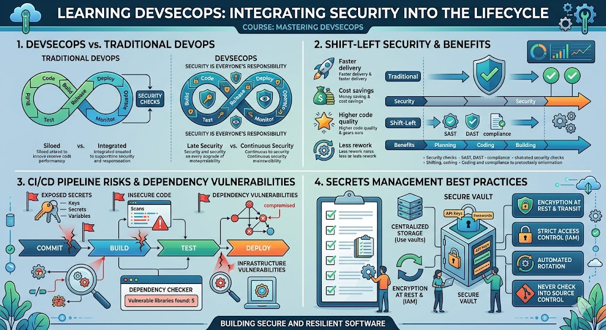

# [4.13] DevSecOps Foundations

## Lesson Overview

## Dependencies
- [Self Studies](./studies.md)
- [Lesson](./lesson.md)
- [Assignment](./assignment.md)

## Lesson Objectives
* **Explain** what DevSecOps is and how it differs from traditional DevOps
* **Describe** the shift-left security approach and its benefits
* **Identify** common security risks in CI/CD pipelines and dependency vulnerabilities
* **Apply** secrets management best practices to protect sensitive credentials

## Lesson Plan

| Duration | What | How or Why |
|----------|------|------------|
| 10 min | Warm up | Intro and lesson overview, why security matters in DevOps |
| 20 min | Part 1: What is DevSecOps? | Definition, traditional vs DevSecOps, principles, real-world Equifax breach |
| 10 min | Activity 1 — Real-world discussion | Discuss Equifax breach and what DevSecOps could have prevented |
| 20 min | Part 2: Shift-left security | What shift-left means, cost table, benefits, shift-left in practice, examples |
| 25 min | Part 3: Pipeline security risks | Hardcoded secrets, vulnerable dependencies, insecure images, attack scenarios |
| 30 min | Part 4: Secrets management | What secrets are, horror stories, environment variables, best practices |
| 10 min | Activity 2 — Spot the security mistake | Learners identify security mistakes in code and config snippets |
| 40 min | Part 5: Dependency vulnerabilities | CVEs, Log4Shell example, scanning tools, transitive dependencies, best practices |
| 15 min | Part 6: Security scanning tools overview | SAST, DAST, dependency scanning, container scanning, OWASP Dependency-Check preview |
| 10 min | Recap and wrap up | Key takeaways, preview Lesson 4.14, Q&A |
| **Total** | | **180 min** |